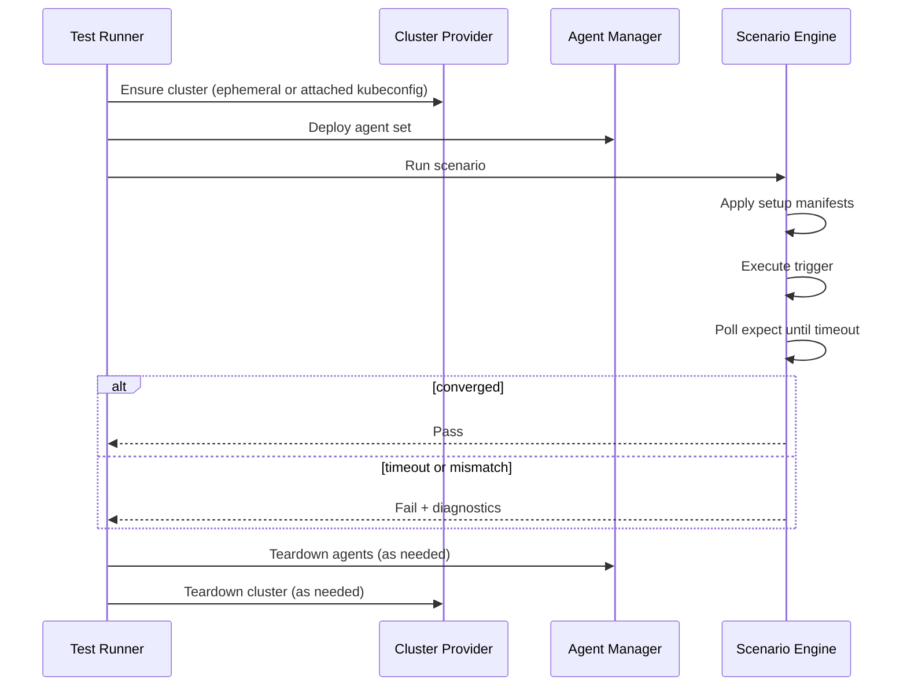

# Architecture

The framework is organized around a **Test Runner** that orchestrates the lifecycle of each scenario and collects results. Three subsystems do the concrete work: cluster lifecycle, agent lifecycle, and scenario execution.

```
┌──────────────────────────────────────────────────┐
│                  Test Runner                      │
│  (orchestrates lifecycle, collects results)       │
└──────┬──────────────┬─────────────────┬──────────┘
       │              │                 │
       ▼              ▼                 ▼
┌────────────┐ ┌─────────────┐ ┌───────────────┐
│  Cluster   │ │   Agent     │ │   Scenario    │
│  Provider  │ │   Manager   │ │   Engine      │
└────────────┘ └─────────────┘ └───────────────┘
       │              │                 │
       ▼              ▼                 ▼
   kind/k3d/     deploy/start/    apply initial
   OpenShift/   stop agents     state, inject
   real cluster                 faults, assert
```

## Test Runner

The Test Runner is the entry point for running scenarios. It:

- Loads scenario definitions (YAML)
- Coordinates the Cluster Provider, Agent Manager, and Scenario Engine for each run
- Records pass/fail and aggregates outcomes
- On failure, triggers collection of [failure diagnostics](failure-diagnostics.md)

The planned CLI (`kube-agents-test run scenarios/`) invokes this orchestration. Scenarios are **data, not code** — the runner is a standalone binary, not a `go test` suite — so the same scenarios can run against ephemeral CI clusters or an existing cluster via kubeconfig.

## Cluster Provider

The **Cluster Provider** supplies a cluster for each test run. It supports two modes:

| Mode | Environment | Typical backend | Lifecycle |
|------|-------------|-----------------|-----------|
| **Ephemeral** | CI, local isolation | `kind`, `k3d`, and similar local cluster tools | Provider creates and tears down the cluster |
| **Attached** | Dev, staging, pre-prod | Existing cluster via kubeconfig | Operator supplies the cluster; provider only validates access |

**Attached** clusters include full production-style platforms — for example **OpenShift**, managed Kubernetes (EKS, GKE, AKS), and on-prem distributions — as long as the operator provides a kubeconfig with sufficient permissions for the scenario namespace and agents under test.

The framework does **not** own a full cluster implementation. It needs a valid **kubeconfig** pointing at a cluster the rest of the stack can use. Whether the cluster is ephemeral or attached, the Agent Manager and Scenario Engine interact with it the same way.

Responsibilities:

- **Ephemeral mode** — Provision a cluster before scenarios that need a fresh environment; tear down or release resources after the run
- **Attached mode** — Accept an existing kubeconfig; optionally verify connectivity and required API groups before scenarios run
- **Both modes** — Supply kubeconfig to the Agent Manager and Scenario Engine

## Agent Manager

The **Agent Manager** controls **which agents run** and **how they run** inside the test cluster.

Deployment modes:

- **Pods** — Production-like: agents run as workloads in the cluster under test.
- **Local processes** — Faster iteration: agents run on the host with cluster credentials.

Controls exposed for scenarios and fault injection:

- **Start / stop individual agents** mid-scenario — For example, restart behavior, leader election after loss of a leader, or partial agent availability.
- **Degraded conditions** — Resource limits or network policies to simulate constrained agents or connectivity.

The manager implements the [Agent Set](core-concepts.md#agent-set) declared in each scenario and any dynamic changes required by triggers or [fault injection](fault-injection.md).

## Scenario Engine

The **Scenario Engine** executes one [Test Scenario](core-concepts.md#test-scenario) end to end:

1. **Apply initial state** — Kubernetes manifests from the scenario `setup` section, or programmatic resource creation equivalent to those manifests.
2. **Fire the trigger** — Optional mutation, agent lifecycle change, or fault (see [Scenarios](scenarios.md) and [Fault injection](fault-injection.md)).
3. **Poll for expected state** — [State assertions](core-concepts.md#state-assertion) until success or **timeout**.
4. **Record result** — Pass or fail; on fail, hand off context for diagnostics (logs, diffs, events, mutation timeline).

The engine is where declarative YAML becomes API calls (apply, patch, watch, poll) using Kubernetes client libraries.

## Data flow for a single run



## Technology alignment

Implementation choices (Go, client-go, kind) are summarized in [Roadmap](roadmap.md#technology-choices). They support this architecture: one language with the agents, direct API access, and ephemeral clusters in CI without extra infrastructure.
