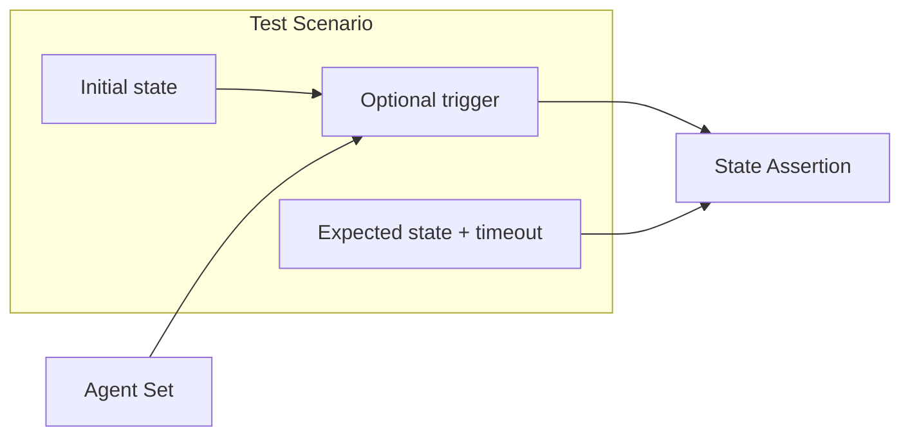

# Core concepts

kube-agents-test is a high-level testing framework for the kube-agents platform: multiple autonomous agents operating on a shared Kubernetes cluster. Unit tests cover individual agents; this framework covers the *system* — agents reacting to the same cluster state, potentially conflicting, racing, or depending on each other's outputs.

Three concepts define every test run.

## Test Scenario

A **Test Scenario** is a declarative description of a single end-to-end test. It specifies four things:

1. **Initial cluster state** — Resources to pre-create before agents act (for example, namespaces, quotas, deployments at a known baseline).
2. **Optional trigger** — An event that starts or perturbs the behavior under test. Triggers include resource mutations, agent restarts, or fault injection (see [Fault injection](fault-injection.md)).
3. **Expected final state** — What the cluster should look like when agents have finished reconciling: resource conditions, field values, or explicit absence of resources.
4. **Timeout for convergence** — How long the framework waits for the cluster to reach the expected state before failing the scenario.

Scenarios are expressed as YAML files; see [Scenarios](scenarios.md) for the format and an example.

The scenario is the unit of work: one file describes one behavioral expectation about the multi-agent system.

## Agent Set

An **Agent Set** is the list of agents that participate in a scenario. The framework does not always run every agent in the platform.

- **Subset of agents** — Run only the agents relevant to the interaction under test. This isolates how specific agents cooperate or conflict without noise from unrelated controllers.
- **Full set** — Run all agents for true integration tests that mirror production-like deployments.

Which agents are active is declared per scenario (the `agents` field in YAML). The [Agent Manager](architecture.md#agent-manager) deploys, starts, stops, or kills agents according to that declaration and any mid-scenario controls the scenario requires.

## State Assertion

A **State Assertion** is how the framework decides pass or fail. Assertions are not one-shot snapshots of the API server.

Agents are **eventually consistent**: they observe the cluster, reconcile, and may retry. The framework therefore uses **polling or watch-based checks** that wait until:

- The expected state is satisfied, or
- The scenario **timeout** expires (failure).

This matches how operators reason about Kubernetes: success means the cluster *converged* to the desired state within a bounded time, not that it matched at an arbitrary instant.

Assertions are declared in the scenario's `expect` section (resource selectors, JSON paths, and expected values). The [Scenario Engine](architecture.md#scenario-engine) applies initial state, fires the trigger, then polls until expectations are met or time runs out.

## How the concepts connect

| Concept | Role |
|---------|------|
| Test Scenario | Defines setup, trigger, expectation, and timeout |
| Agent Set | Defines which reconcilers run during the test |
| State Assertion | Defines how and when convergence is verified |

Together they answer: *given this starting cluster and these agents, after this event, should the cluster look like X within T?*
