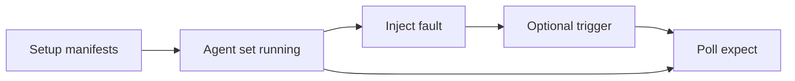

# Fault injection

Fault injection provides **optional hooks** that can be composed into [scenarios](scenarios.md). Use them to test [convergence and recovery](scope.md) when agents or the cluster are disturbed — not for everyday happy-path tests.

Faults align with triggers described in the design: resource mutation, agent restart, and explicit fault hooks orchestrated by the [Agent Manager](architecture.md#agent-manager) and [Scenario Engine](architecture.md#scenario-engine).

## Supported faults

| Fault | Mechanism | Purpose |
|-------|-----------|---------|
| **Kill agent** | Delete pod or kill process | Verify recovery, leader re-election, and catch-up after loss of an agent instance |
| **Network partition** | NetworkPolicy between agent and API server | Verify agent behavior when it cannot reach the cluster (retries, backoff, safe degradation) |
| **Slow API server** | Latency injected via proxy | Verify timeout and retry logic under delayed API responses |
| **Stale cache** | Restart informer without full resync | Verify correctness when the agent has partial or outdated cached state |
| **Resource conflict** | Concurrent update from the test harness | Verify conflict detection and retry when another writer touches the same object |

Each fault targets a different failure mode: process availability, connectivity, API timing, informer freshness, and optimistic concurrency.

## How faults fit scenarios

A typical scenario still has **setup**, optional **trigger**, and **expect** with a **timeout**. Fault injection adds a controlled perturbation **during** the run:

For example:

- **Kill agent** after setup but before or after a **trigger** — Asserts that remaining agents or a restarted agent restore [expected final state](core-concepts.md#test-scenario).
- **Network partition** — Asserts agents do not corrupt cluster state when disconnected and reconcile correctly when connectivity returns (within timeout).
- **Resource conflict** — Asserts an agent's retry path when the harness applies a competing patch.

Exact YAML schema for each fault will follow implementation; the README defines the fault catalog and mechanisms above.

## Agent Manager and Cluster Provider roles

| Component | Fault-related responsibility |
|-----------|------------------------------|
| **Agent Manager** | Kill pods/processes; restart agents; apply resource limits or network policies for degraded or partitioned agents |
| **Scenario Engine / harness** | Apply concurrent patches for conflict tests; coordinate timing of faults relative to triggers |
| **Cluster / proxy layer** | Slow API server injection (design: via proxy), not owned entirely by the framework's cluster abstraction |

The framework does not reimplement Kubernetes; it orchestrates standard mechanisms (pods, NetworkPolicy, patches, informer lifecycle) to simulate realistic failures.

## Scope reminder

Fault injection supports **in-scope** system tests: recovery after crash, behavior under degradation, and correct final state. It does not replace unit tests for internal retry functions or performance testing under load. See [Scope](scope.md).

## Failure analysis

When a fault scenario fails, use [Failure diagnostics](failure-diagnostics.md) — especially agent logs, events, diffs, and the mutation timeline — to see whether the fault was applied at the right time and how agents responded before timeout.
