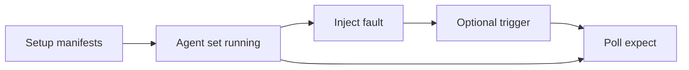

# Fault injection

Fault injection provides **optional hooks** that can be composed into [scenarios](scenarios.md). Use them to test [convergence and recovery](scope.md) when agents or the cluster are disturbed — not for everyday happy-path tests.

Faults align with triggers described in the design: resource mutation, agent restart, and explicit fault hooks orchestrated by the [Agent Manager](architecture.md#agent-manager) and [Scenario Engine](architecture.md#scenario-engine).

## Supported faults

| Fault | Mechanism | Purpose |
|-------|-----------|---------|
| **Kill agent** | Delete pod or kill process | Verify recovery, leader re-election, and catch-up after loss of an agent instance |
| **Network partition** | NetworkPolicy between agent and API server | Verify agent behavior when it cannot reach the cluster (retries, backoff, safe degradation) |
| **Slow API server** | Latency injected via proxy | Verify timeout and retry logic under delayed API responses |
| **Stale cache** | Restart informer without full resync | Verify correctness when the agent has partial or outdated cached state |
| **Resource conflict** | Concurrent update from the test harness | Verify conflict detection and retry when another writer touches the same object |

Each fault targets a different failure mode: process availability, connectivity, API timing, informer freshness, and optimistic concurrency.

## How faults fit scenarios

A typical scenario still has **setup**, optional **trigger**, and **expect** with a **timeout**. Fault injection adds a controlled perturbation **during** the run:

### Example scenarios

**Kill agent — recovery after leader loss**

Setup deploys a replicated agent (e.g. leader-elected controller) and initial resources. After agents converge on setup, the fault kills the leader pod. The scenario expects a new leader to be elected and the same [expected final state](core-concepts.md#test-scenario) to be reached within the timeout — for example, a quota or scaling decision still applied correctly after failover.

**Kill agent — mid-reconciliation**

Setup and trigger run as in a normal scenario (e.g. patch replicas). The fault kills one agent instance while others are still reconciling. Expect asserts that the surviving agents (or a restarted instance) still drive the cluster to the declared conditions without leaving partial or conflicting writes.

**Network partition — agent isolated from API server**

Setup starts the full [agent set](core-concepts.md#agent-set). A NetworkPolicy blocks the partitioned agent from the Kubernetes API. Expect asserts no destructive changes to shared resources during the partition (e.g. spec fields unchanged or safe status only). After the fault is cleared, expect asserts full convergence within the timeout.

**Slow API server — timeout and retry**

Setup and trigger exercise an agent that depends on timely API responses. Latency injected via proxy delays reads/writes. Expect asserts the cluster still reaches the correct final state without the agent applying incorrect partial updates — validating retry and timeout behavior under delayed responses.

**Stale cache — informer restart without full resync**

After setup converges, the fault restarts an agent's informer without a full resync so it holds partial cached state. A trigger then changes a resource the agent watches. Expect asserts the agent reconciles from incomplete cache to the correct outcome (e.g. respects quota or ownership rules) within the timeout.

**Resource conflict — concurrent harness update**

Setup places a resource under agent control. The trigger and fault apply a competing patch from the test harness on the same object (same resourceVersion contention). Expect asserts the agent's conflict retry path wins or merges safely and the declared conditions on the resource still hold.

**Combined degradation — partition then kill**

For multi-agent scenarios: network partition one agent, then kill another. Expect asserts the remaining connected agents do not corrupt shared state and that after faults are removed, the full agent set restores [expected final state](core-concepts.md#test-scenario). Useful for testing ordering and independence when multiple failure modes overlap.

Exact YAML schema for each fault will follow implementation; the README defines the fault catalog and mechanisms above.

## Agent Manager and Cluster Provider roles

| Component | Fault-related responsibility |
|-----------|------------------------------|
| **Agent Manager** | Kill pods/processes; restart agents; apply resource limits or network policies for degraded or partitioned agents |
| **Scenario Engine / harness** | Apply concurrent patches for conflict tests; coordinate timing of faults relative to triggers |
| **Cluster / proxy layer** | Slow API server injection (design: via proxy), not owned entirely by the framework's cluster abstraction |

The framework does not reimplement Kubernetes; it orchestrates standard mechanisms (pods, NetworkPolicy, patches, informer lifecycle) to simulate realistic failures.

## Scope reminder

Fault injection supports **in-scope** system tests: recovery after crash, behavior under degradation, and correct final state. It does not replace unit tests for internal retry functions or performance testing under load. See [Scope](scope.md).

## Failure analysis

When a fault scenario fails, use [Failure diagnostics](failure-diagnostics.md) — especially agent logs, events, diffs, and the mutation timeline — to see whether the fault was applied at the right time and how agents responded before timeout.
