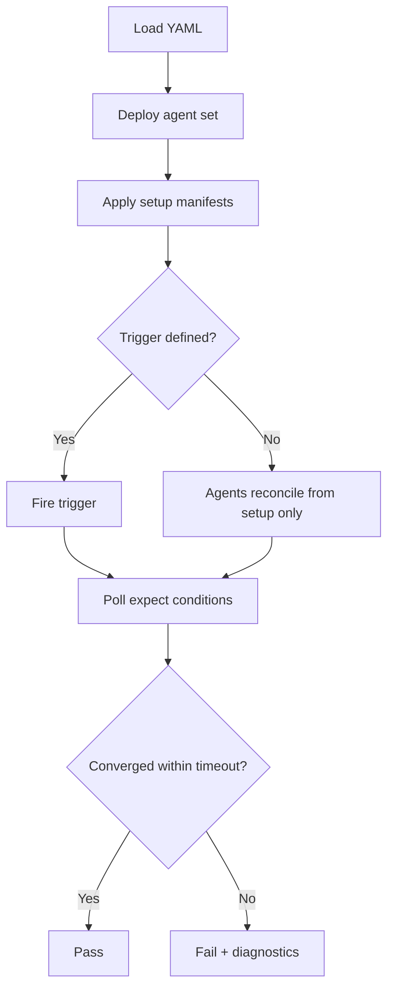

# Scenarios

A scenario is a **YAML file** that fully describes one high-level test: participating agents, initial cluster state, optional trigger, expected final state, and convergence timeout.

## File structure

| Section | Required | Purpose |
|---------|----------|---------|
| `name` | Yes | Identifier for the scenario |
| `description` | Recommended | Human-readable intent |
| `agents` | Yes | [Agent set](core-concepts.md#agent-set): which agents run |
| `setup` | Yes | Initial cluster state (typically manifests) |
| `trigger` | No | Event that perturbs the system under test |
| `expect` | Yes | [State assertions](core-concepts.md#state-assertion) and timeout |

## Example

This scenario verifies interaction between a scaling agent and a quota agent: scaling wants more replicas, but quota caps the namespace.

```yaml
name: scaling-agent-respects-quota-agent
description: >
  When the scaling agent wants to add replicas but the quota agent has
  capped the namespace, the deployment should stay at the capped count.

agents:
  - scaling-agent
  - quota-agent

setup:
  manifests:
    - fixtures/namespace-with-quota.yaml
    - fixtures/deployment-at-limit.yaml

trigger:
  patch:
    apiVersion: apps/v1
    kind: Deployment
    name: target
    namespace: test
    spec:
      replicas: 10  # scaling agent wants 10

expect:
  - resource:
      apiVersion: apps/v1
      kind: Deployment
      name: target
      namespace: test
    conditions:
      - path: .spec.replicas
        value: 5  # quota agent should cap it
      - path: .status.readyReplicas
        value: 5
  timeout: 120s
```

### Reading the example

1. **`agents`** — Only `scaling-agent` and `quota-agent` run; other platform agents are excluded to focus the interaction.
2. **`setup.manifests`** — Pre-creates namespace quota and a deployment already at the limit so agents start from a known state.
3. **`trigger.patch`** — Simulates a desire for 10 replicas (e.g. user or controller change). The scaling agent may try to scale up; the quota agent should enforce the cap.
4. **`expect`** — Declares the Deployment resource and JSON-path conditions on `.spec.replicas` and `.status.readyReplicas`, both expected to be `5`.
5. **`timeout: 120s`** — The [Scenario Engine](architecture.md#scenario-engine) polls until both conditions hold or 120 seconds elapse.

## Lifecycle

For each scenario file, execution follows this order (see [Scenario Engine](architecture.md#scenario-engine)):



## Triggers

The design supports triggers that change runtime behavior without replacing the whole scenario structure:

- **Resource mutation** — Such as the `patch` block in the example: API version, kind, name, namespace, and fields to apply.
- **Agent restart** — Exercised via [Agent Manager](architecture.md#agent-manager) controls (start/stop mid-scenario).
- **Fault injection** — Optional hooks documented in [Fault injection](fault-injection.md); composable into scenarios where recovery or degradation must be tested.

Exact trigger schema for every fault type will match implementation; the README defines patch-style triggers and points to agent lifecycle and fault hooks as additional trigger classes.

## Setup

Initial state is typically a list of manifest paths under `setup.manifests`. The engine applies them to the cluster before triggers and assertions. Fixtures live beside or under scenario directories (e.g. `fixtures/namespace-with-quota.yaml`).

## Expectations and timeout

The `expect` section lists one or more resource checks. Each check can target a resource by API version, kind, name, and namespace, with **conditions** expressed as JSON paths (`path`) and expected `value`.

The **timeout** applies to the whole assertion phase: the framework waits for **eventual** satisfaction of all conditions, consistent with [State Assertion](core-concepts.md#state-assertion).

## Running scenarios

The planned interface is a CLI that runs one or more scenario files or directories:

```text
kube-agents-test run scenarios/
```

The [Test Runner](architecture.md#test-runner) loads YAML, provisions cluster and agents as needed, and reports results. CI integration (e.g. GitHub Actions) is planned as part of the implementation roadmap.
